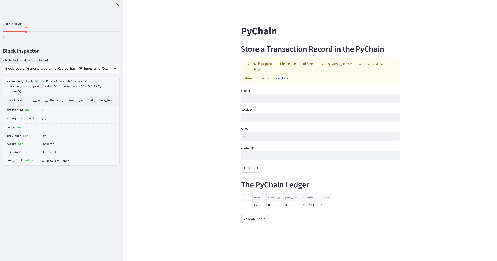
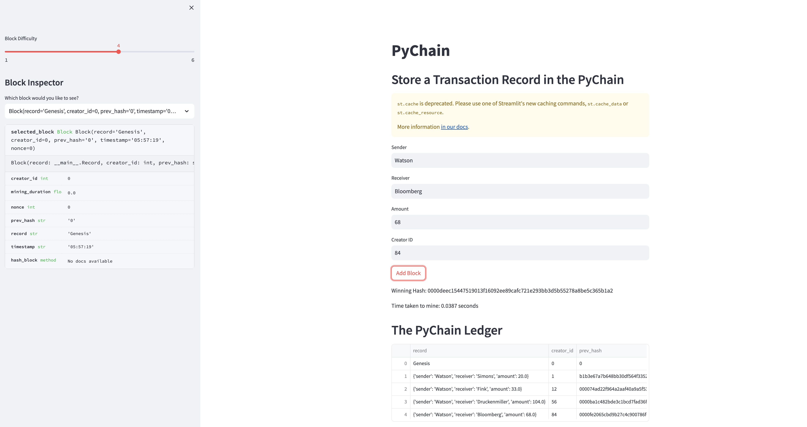
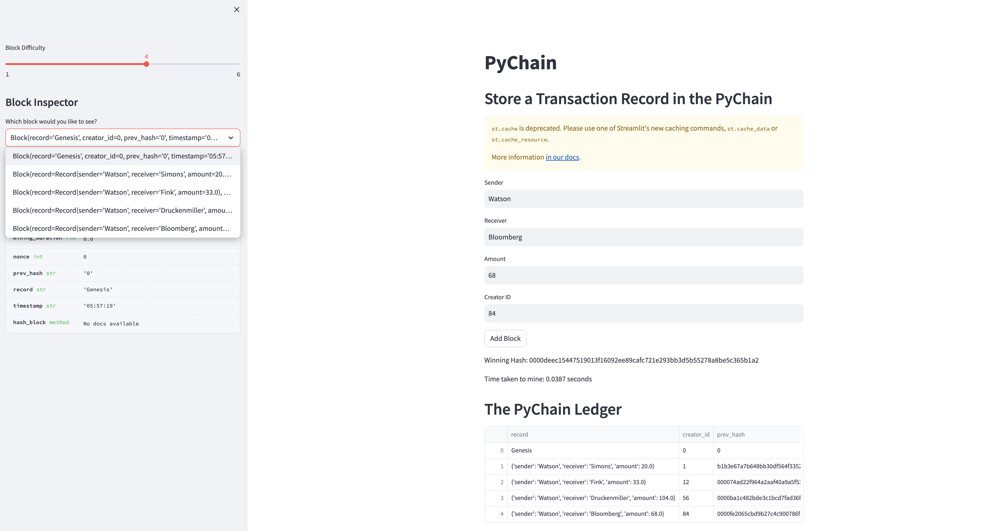
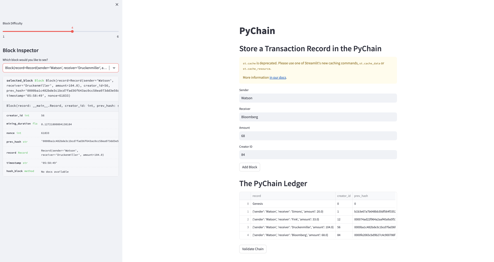
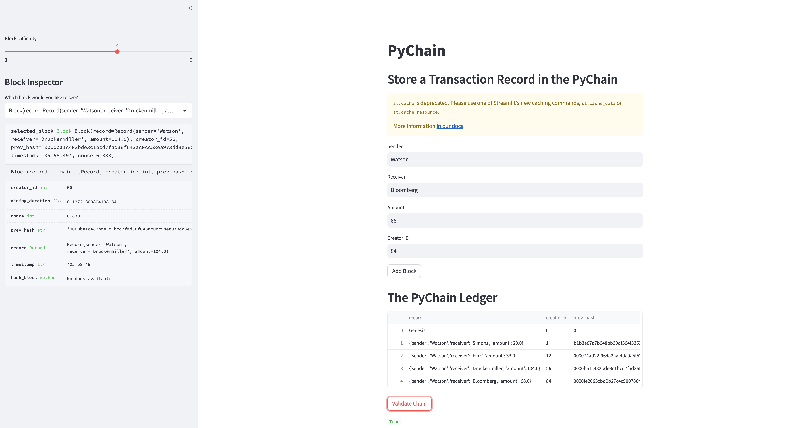

# Building a Blockchain

This project was completed to demonstrate knowledge on how to build a simple blockchain complete with ledger.

Below outlines the steps taken in the project:

1. [Create a Record Data Class](create-a-record-data-class)
2. [Modify Block Data Class to Store Record Data](modify-block-data-class-to-store-record-data)
3. [Refine the Streamlit Interface](refine-the-streamlit-interface)
4. [Test the PyChain Ledger](test-the-pychain-ledger)
    * [Genesis Block](genesis-block)
    * [The Ledger](the-ledger)
    * [Block Inspector](block-inspector)
    * [Detailed Inspection](detailed-inspection)
    * [Blockchain Validation](blockchain-validation)
  
### Create a Record Data Class
* This section holds the relevant data in the Record class to enable historical recordings.

### Modify Block Data Class to Store Record Data
* The Block class hold all of the relevant details for each block that is excecuted each time a transaction is actioned.
* The PyChain class is used to create a chain for the blockchain, includining mining_duration and validation. 

### Refine the Streamlit Interface
* This area of the code has modifications that display the changes in a WebUI so that user can create new blocks, view the ledger, view historical blocks and validate the blockchain.

### Test the PyChain Ledger
* Testing shows the genesis block, the ledger, block inspector, detailed inspection and blockchain validation.

#### Genesis Block

#### The Ledger

#### Block Inspector

#### Detailed Inspection

#### Blockchain Validation

